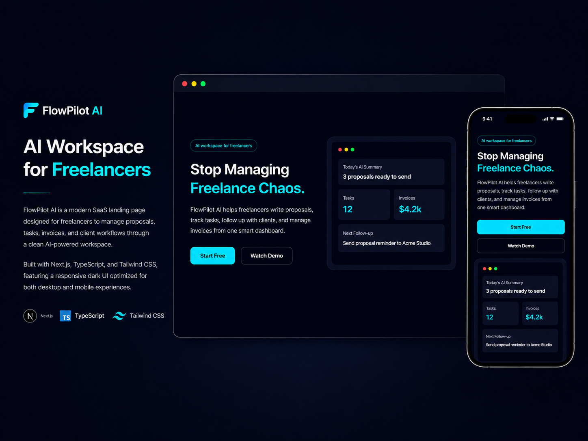

# FlowPilot AI Landing Page

A modern AI-powered SaaS landing page built for freelancers to manage proposals, tasks, invoices, and client workflows through a clean and responsive interface.



## Live Demo

🔗 [https://my-flowpilot-ai.vercel.app/](https://my-flowpilot-ai.vercel.app/)

---

## Features

- Modern SaaS landing page UI
- Fully responsive design
- Dark mode interface
- Mobile & desktop optimized
- Reusable component architecture
- Smooth layout and spacing system
- Clean typography and visual hierarchy

---

## Built With

- Next.js
- TypeScript
- Tailwind CSS
- React Icons

---

## Getting Started

Clone the repository:

```bash
git clone https://github.com/rawdaymohamed/flowpilot-ai.git
```

Navigate into the project:

```bash
cd flowpilot-ai
```

Install dependencies:

```bash
npm install
```

Run the development server:

```bash
npm run dev
```

Open:

```bash
http://localhost:3000
```

---

## Project Structure

```bash
src/
 ├── app/
 ├── components/
 │    ├── Hero.tsx
 │    ├── Features.tsx
 │    ├── HowItWorks.tsx
 │    ├── Testimonials.tsx
 │    ├── Pricing.tsx
 │    ├── FAQ.tsx
 │    └── Footer.tsx
```

---

## Author

Rawda Yasser
Freelance Full Stack Web Developer
